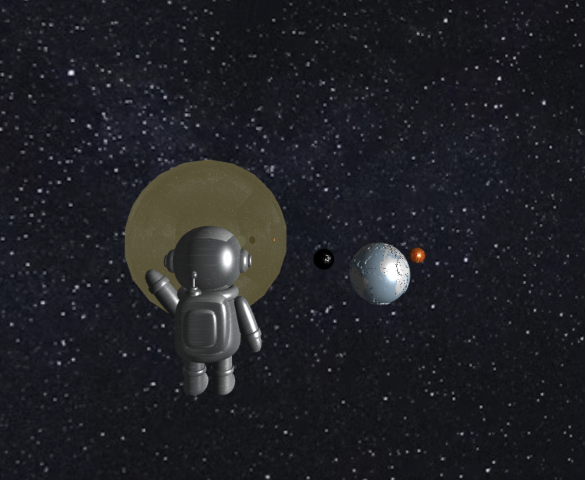

# Final Project

## Execution Instructions

To run the project, follow these steps:

1. Open a terminal.
2. Navigate to the project directory.
3. Run the following command to start a local HTTP server:
   ```sh
   python -m http.server 8888
   ```
4. Open a browser and go to:
   ```
   http://localhost:8888
   ```

## Asset Copyright Information

The following assets are used in this project with proper attribution:

- **earthText.jpg**: Marina Leonova - [Pexels](https://www.pexels.com/zh-tw/photo/7634436/)
- **metal.jpg**: Hoang Le - [Pexels](https://www.pexels.com/zh-tw/photo/978462/)
- **spmanText.jpg**: András Szakács - [Pexels](https://www.pexels.com/zh-tw/photo/30857714/)
- **sunText.jpg**: Pixabay - [Pexels](https://www.pexels.com/zh-tw/photo/73873/)
- **up.jpg**: Kai Pilger - [Pexels](https://www.pexels.com/zh-tw/photo/1341279/)
- **wall.jpg**: Pixabay - [Pexels](https://www.pexels.com/zh-tw/photo/207142/)
- **3D Models (.obj files)**: Downloaded from [Blender](https://www.blender.org)
- **cuon-matrix.js**: (c) 2012 Kanda and Matsuda

